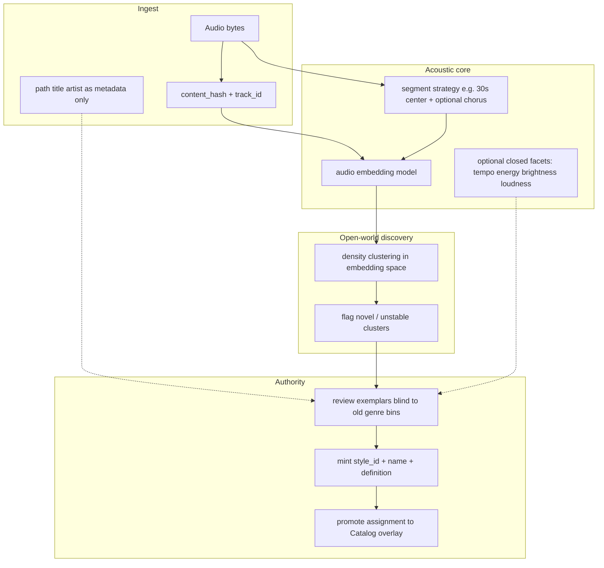

# Safe Build Review

Source: https://chatgpt.com/c/6a6e5907-2c84-83e8-95c5-25effb8a424a

## USER
Am i safe to build this?

Style Atlas bolt-on (safe merge with Catalog)

Decision (committed)

Build Style Atlas as a sibling bolt-on under EchoVerse (new project or META.EDIT product surface expansion), not inside Catalog PWA / catalog_disk_scan / analyzer fill-missing hot path.


Workers/agents own embedding, clustering, suggestions, and “mint style” proposals.


Catalog / library.db only change when an explicit promote/ingest step writes accepted labels (same trust pattern as Batch ingest → Library API).


ByteTag (META.EDIT) stays the interactive metadata studio for ID3 on disk; phase 2 adds Style Atlas review/mint UI there (or proxied beside /bytetag/). ByteTag does not become the GPU embedding worker.

Default write target on promote: track_overlays.metadata_overrides + style entities in Atlas DB first; promote into catalog_tracks.genre|style|mood only when marked locked/editorial (or high-confidence human-accepted). Existing acoustic fill stays demotable as estimates.

Why this shape


Concern


How bolt-on helps


Don’t break browse/playback


Catalog keeps serving :5304 / :5307 unchanged


Don’t poison genre again


Suggestions live in Atlas until accepted


Weird / new styles


Open vocabulary + cluster minting outside closed analyzer bins


Agents/workers


Long jobs, retries, versioned runs — outside library-api request path


ByteTag fit


Already auth’d to Library API, path→track_id, operator UX — good review surface; bad place for heavy ML

flowchart LR
 subgraph hot [Hot path unchanged]
 Music[Music/Albums]
 LibAPI[library-api :5304]
 CatalogUI[catalog-v4 :5307]
 Music --> LibAPI --> CatalogUI
 end

 subgraph atlas [Style Atlas bolt-on]
 Workers[embed_cluster_agents]
 AtlasDB[atlas_db suggestions styles]
 ReviewUI[ByteTag_or_Atlas_UI]
 Workers --> AtlasDB --> ReviewUI
 end

 LibAPI -->|"read-only catalog dump / track ids"| Workers
 ReviewUI -->|"POST promote accepted labels"| LibAPI
 ReviewUI -.->|"optional ID3 write"| Music

Current anchors (reuse, don’t reinvent)


Catalog SoT: [library.db](EchoVerse_Music_Catalog.v.nx/library-api/catalog_db.py) via [:5304](EchoVerse_Music_Catalog.v.nx/library-api/README.md)


Existing fill writes estimates into catalog_tracks from analyzer heuristics ([docker/analyzer/main.py](EchoVerse_Music_Catalog.v.nx/docker/analyzer/main.py)) — do not extend that for open styles


ByteTag today: interactive ID3 editor in [META.EDIT/](META.EDIT/); resolve/auth via Library API; no direct overlay write; Batch ingest is the enrichment writeback pattern (platform docs)


Provenance already exists in spirit: analysis_runs, overlays analysis_snapshot — Atlas should mirror that with its own run IDs

Safe merge contract

Read from Catalog (pull): listable track_id, paths, existing locked overlays, album/artist — via Library API or periodic dump. Workers never mount-write catalog DB.

Write to Catalog (push, gated):


POST /api/catalog/style-atlas/promote (new, capability-gated) or reuse overlay PATCH + dedicated style-entity endpoints


Payload: { track_ids, labels, style_id?, provenance, confidence, lock? }


Rules:


Never overwrite human-locked overlay fields


Never wipe BPM/key/loudness


Acoustic genre_estimate remains estimate; Atlas minted styles are separate keys (styles[], mood_tags[], optional primary)


Optional later: ByteTag ID3 writeback for accepted genre/style strings (file SoT for portability)

Side store (Atlas DB): embeddings, clusters, style entities {id, name, definition, exemplars, aliases}, suggestion queue, agent run log. Can live in its own SQLite/Postgres volume — not mixed into request-path catalog queries until promoted.

Phased rollout

Phase 0 — Guardrails (Catalog, small)


Treat current analyzer genre/style/mood as estimates in UI/API (already partially done)


Document: Atlas is future SoT for named styles; fill-missing must not re-promote low-confidence bins over locked Atlas labels

Phase 1 — Bolt-on skeleton (no Catalog behavior change)


New compose service(s): style-atlas-api + worker (or one API + queue)


Ingest job: pull track list from :5304, embed offline, store vectors + cluster IDs


Operator read-only UI or CLI: browse clusters / “sounds like”


Zero writes to library.db yet

Phase 2 — Human accept → feed Catalog


Review queue (in ByteTag or Atlas UI): accept / reject / mint style name


Promote endpoint writes overlays + provenance


Catalog browse can show minted styles when present; else fall back to estimates

Phase 3 — Agents


Scheduled workers: re-embed new tracks, propose merges, flag novel clusters


Agent may draft style names + exemplar sets; human (or explicit policy) mints


Still no silent overwrite of locked labels

Phase 4 — ByteTag upgrade (product), optional ID3


Extend [META.EDIT](META.EDIT/) as “Metadata + Style Atlas” studio: same auth, path resolve, plus cluster review


Keep heavy compute in worker containers; ByteTag UI calls Atlas API


Optional: write accepted tags to ID3 via existing ByteTag write path

Options considered (rejected as primary)


Option


Verdict


Bake open-world styles into Catalog Analyzer fill-missing


Rejected — already polluted genre; hot path


Replace ByteTag entirely with ML service


Rejected — loses ID3 studio; wrong process model


Agents write catalog_tracks directly


Rejected — unsafe; bypasses auth/provenance


Only improve 8-bin heuristic


Rejected — can’t mint new EchoVerse styles

Risks and boundaries


GPU/CPU: workers on NXCore must be profiled / scheduled off peak


Authority: promote requires same caps as metadata edit (canEditMetadata or stricter canMintStyles)


Dual labels: UI must distinguish estimate vs minted vs locked


Do not revive :5300; Atlas talks only to :5304


Deploy Atlas only with explicit approval; Catalog deploy independent

Success criteria


Catalog playback/browse unaffected when Atlas is down


Suggestions visible in Atlas without changing genre distribution in catalog_tracks


Accepted mint appears in overlay/catalog with provenance and is not overwritten by nightly acoustic fill


New style names can exist without being in the analyzer’s 8 bins

## ASSISTANT
I’m treating this as a production architecture review, not just a concept check. I’ll separate what is safe now from what must be locked before any catalog writes.

## ASSISTANT
## Verdict

**Yes—you are safe to build this as designed, with one important boundary:**

- **Phase 0 and Phase 1 are approved to begin.**
- **Phase 2 catalog writes should remain disabled until the promotion contract, precedence rules, and rollback tests are proven.**

The architecture is fundamentally sound. Keeping Style Atlas outside the Catalog analyzer and playback request path is exactly the right response to the earlier genre pollution problem.

I would approve the build after tightening the following items.

## Required corrections before implementation

### 1. Define authority more precisely

Avoid saying Atlas is the single source of truth for everything style-related.

Use this split:

- **Atlas DB:** source of truth for style definitions, aliases, exemplars, embeddings, clusters, and proposals.
- **Catalog overlay:** source of truth for which accepted styles are assigned to a track.
- **Audio file tags:** portable copy, written only through an explicit optional writeback operation.
- **Acoustic analyzer:** source of estimates only.

That prevents Atlas and Catalog from becoming competing authorities.

### 2. Separate “mint style” from “promote assignment”

These should be separate backend operations, even when the UI presents them as one workflow:

```text
POST /api/styles
POST /api/styles/{style_id}/aliases
POST /api/catalog/style-atlas/promotions
```

Minting creates or changes the taxonomy.

Promoting assigns an existing versioned style entity to one or more tracks.

Do not allow a bulk promotion request to silently create new style entities from arbitrary label strings.

### 3. Use stable style IDs, not only names

Do not promote only:

```json
{
 "styles": ["SwampHop"]
}
```

Prefer:

```json
{
 "style_assignments": [
 {
 "style_id": "sty_swamp_hop",
 "style_version": 3,
 "display_name": "SwampHop",
 "role": "primary"
 }
 ]
}
```

Names and aliases will change. Stable IDs prevent renamed styles from fragmenting the library.

The Catalog should retain a denormalized display-name snapshot so accepted styles still display while Atlas is unavailable.

### 4. Physically separate estimates from accepted metadata

This is the most important technical safeguard.

The analyzer should not continue writing estimates into the same effective fields used by editorial labels.

Use separate namespaces such as:

```json
{
 "genre_estimate": {
 "value": "Hip-Hop",
 "confidence": 0.61,
 "run_id": "analysis_8821"
 },
 "accepted_styles": [
 {
 "style_id": "sty_swamp_hop",
 "name": "SwampHop",
 "source": "style_atlas",
 "decision": "human_accepted",
 "locked": true
 }
 ]
}
```

Resolution order should be explicit:

```text
locked editorial assignment
→ accepted human assignment
→ accepted policy assignment
→ acoustic estimate
→ unknown
```

Do not rely on every worker remembering not to overwrite fields. Enforce precedence inside the Library API or overlay resolver.

## Promotion endpoint requirements

I strongly recommend the dedicated promotion endpoint rather than reusing a general metadata PATCH.

A safe request should include:

```json
{
 "idempotency_key": "atlas-promote-20260801-00042",
 "expected_overlay_version": 17,
 "track_ids": ["trk_123", "trk_456"],
 "assignments": [
 {
 "style_id": "sty_swamp_hop",
 "style_version": 3,
 "role": "primary"
 }
 ],
 "provenance": {
 "atlas_run_id": "run_20260801_04",
 "cluster_id": "cluster_87",
 "model": "audio-embedding-v1",
 "model_version": "1.0.0",
 "decision": "human_accepted",
 "reviewer": "principal-id"
 },
 "confidence": 0.93,
 "lock": true
}
```

The endpoint must provide:

- Idempotency.
- Optimistic concurrency through an overlay version or ETag.
- Dry-run mode.
- Per-track success and failure results.
- Audit identity and timestamp.
- Rejection when a locked value would be replaced.
- A rollback or superseding promotion mechanism.
- Validation that `primary` is also included in the accepted style assignments.
- A separate capability for applying locks.

Do not let possession of `canEditMetadata` automatically grant the ability to mint taxonomy or perform mass promotions.

Suggested capabilities:

```text
styleAtlas.read
styleAtlas.review
styleAtlas.assign
styleAtlas.mint
styleAtlas.lock
styleAtlas.admin
```

## Track identity needs strengthening

Path alone is not enough for embedding records.

Key embeddings and suggestions using:

```text
track_id
audio fingerprint or content hash
embedding model/version
segment strategy/version
analysis run ID
```

This handles:

- File renames.
- Folder moves.
- Duplicate files.
- Replaced audio under the same path.
- Re-embedding after a model upgrade.
- Alternate versions of the same song.

A path can remain useful operational metadata, but it should not identify the embedding.

## Worker isolation

The worker service should have:

- Read-only Catalog credentials.
- No mounted write access to `library.db`.
- No writable music mount during Phases 1–3.
- CPU, memory, and GPU limits.
- Configurable concurrency.
- Off-peak scheduling.
- Cancelable and retryable jobs.
- Checkpoints for long runs.
- Run-level status and error logs.
- Versioned models and clustering parameters.

The promoter service—not the embedding worker—should hold the narrowly scoped credential capable of calling the Catalog promotion endpoint.

That is safer than giving all Atlas containers the same token.

## ID3 writeback boundary

Keep ID3 writeback out of the initial Atlas release.

When added, it should use a dedicated writeback worker with:

- Original-tag snapshots.
- Temporary-file plus atomic-replace behavior.
- File locking.
- Per-file rollback information.
- Rescan-loop prevention.
- Clear handling of file modification timestamps.
- A preview of exactly which frames will change.

Otherwise, an accepted style can trigger ByteTag writeback, catalog rescan, analyzer processing, and accidental metadata churn.

## Tests required before enabling Phase 2

The write gate should remain closed until these pass:

1. Atlas can be stopped without affecting browse or playback.
2. Repeating the same promotion produces no duplicate assignment.
3. A locked human assignment survives nightly analyzer processing.
4. Promotion cannot modify BPM, key, loudness, artist, album, or unrelated overlays.
5. An outdated overlay version returns a conflict instead of overwriting newer work.
6. Partial batch failure reports exact per-track results and can safely retry.
7. Style renaming does not orphan prior assignments.
8. File rename does not require re-review when the audio fingerprint is unchanged.
9. Replaced audio invalidates or marks old suggestions stale.
10. Unauthorized users cannot mint, lock, or bulk-promote.
11. A promotion can be rolled back without restoring the entire database.
12. Catalog deployment and Atlas deployment remain independent.

## Recommended build decision

### Green light now

Build:

- New Style Atlas repository or clearly isolated product package.
- Atlas API.
- Atlas database and migrations.
- Read-only Catalog ingestion.
- Versioned embedding runs.
- Cluster storage.
- Read-only cluster and similarity UI.
- Worker scheduling and resource controls.
- Style entity drafts, aliases, exemplars, and review status.
- No Catalog writes.

### Hold until tested

Do not yet enable:

- Catalog promotion writes.
- Automatic locking.
- Policy-based acceptance.
- ID3 writeback.
- Agent-created styles becoming active without review.
- Catalog browse depending live on Atlas API.

## Final approval

**This is a good architecture and substantially safer than extending the existing analyzer.** The main danger is no longer the embedding or clustering work. The danger is ambiguity at the promotion boundary.

Lock down:

1. Authority by object.
2. Estimate-versus-accepted precedence.
3. Stable style IDs.
4. Idempotent, capability-gated promotion.
5. Rollback and audit history.

With those enforced, you are safe to start building the bolt-on skeleton now. Phase 1 presents very little risk to the existing EchoVerse Catalog because it is additive, read-only, independently deployable, and removable without touching playback.

## USER
explan this to me

### North star

```text
waveform → embedding → cluster → review → mint style ID → (optional) assign to tracks
```

Titles, artists, folders, and ID3 genre are **display / provenance**, not features for clustering.

---

### Optimum pipeline (phases)



#### 1. Identity (not style)
- Key rows by **`content_hash` + embed model/version + segment strategy + run_id`**
- Path/title/artist stored beside the vector, **not inside it**

#### 2. Ears (replace `catalog-features-v1`)
Pick one primary:

| Option | Role |
|--------|------|
| **CLAP / MuQ / similar audio–text model** | Best general “sounds like” space; text used later for *naming*, not for clustering |
| **OpenL3 / VGGish** | Stronger offline, less “semantic” |
| **Custom EchoVerse fine-tune** | Later, once you have minted styles as training labels |

Also compute **closed acoustic facets** (BPM, key, LUFS, energy, brightness) as **filters**, never as genre names. Do **not** feed the old 8-bin Rock/Metal classifier into Atlas.

**Hard rule:** embedding vector = `f(audio_samples)` only. 
Ban from the vector: title, artist, album, folder, ID3 genre, “aerovista”.

#### 3. Discover (open vocabulary)
- Density clustering (HDBSCAN / similar) in embedding space 
- Album-aware option so one album doesn’t invent a fake “style” 
- Outputs: `cluster_id`, exemplar track_ids, cohesion score — **no style name yet** 
- Draft names if any should be blank or `cluster_N`, not `Draft like aerovista`

#### 4. Human mint (where language is allowed)
- Reviewer hears 5–8 exemplars (optionally **blind** to filename) 
- Actions: mint / merge / split / reject 
- Creates `style_id` + version + definition + exemplars in **Atlas DB** 
- Optional: ask a text model “describe these” **after** listen, as a suggestion only

#### 5. Assign (Catalog feed)
- Promote `style_id` + version onto tracks via gated endpoint 
- Catalog shows denormalized display name; estimates stay in `genre_estimate` namespace 
- Old analyzer bins never overwrite locked/accepted styles

#### 6. Agents (assist, don’t decide)
- Re-embed new files 
- Propose “this track is near style X” 
- Propose “new dense region appeared” 
- **Never** auto-mint or auto-lock

---

### What to stop doing

| Anti-pattern | Why |
|--------------|-----|
| Hash + title + artist vectors | Biased clusters, `Draft like aerovista` |
| 8-bin spectral “genre” as SoT | Rock/Metal / Jazz/Blues flood |
| Filling `catalog_tracks.genre` from estimates | Editorial pollution |
| Naming clusters from artist/folder | Closes the open-world loop early |

---

### Practical “optimum for EchoVerse now”

1. **Worker:** decode MP3 → fixed segment(s) → CLAP (or OpenL3) embedding → store vector 
2. **Cluster:** HDBSCAN on vectors only; ignore ID3 genre 
3. **UI:** cluster browser with playable exemplars; mint form 
4. **Keep:** BPM/key/loudness as facets for filters 
5. **Hold:** Catalog promote until review works on `test-albums` 
6. **Later:** fine-tune or style prototypes once you have ~20–50 minted EchoVerse styles

---

### Success test on `test-albums`

You know it’s working when:

- Clusters group **similar-sounding** tracks even with messy titles 
- Drafts are **not** “like aerovista” 
- Renaming a file doesn’t move its cluster (same `content_hash`) 
- Two different-sounding tracks with the same artist stay apart 

---

**One line:** optimum pipeline is **embed the sound → cluster the space → humans name the islands → Catalog only stores accepted islands** — never cluster on the words that already failed you.

If you want to implement next, the smallest high-value step is wiring an **audio-only embedder** into the Style Atlas worker and re-running `test-albums` with title/artist **excluded** from the vector.

## ASSISTANT
Think of **Style Atlas as drawing a map of how your songs sound**.

It does not begin by asking what the file is called, who the artist is, what folder it lives in, or what genre tag somebody previously typed. It listens to the audio, converts that sound into numbers, groups similar sounds together, and then lets a human decide what those groups should be called.

## The whole pipeline in plain English

```text
waveform → embedding → cluster → review → mint style ID → assign to tracks
```

That means:

### 1. Waveform

This is the actual audio.

The drums, vocals, instruments, distortion, rhythm, texture, energy, and production.

The system starts with the sound itself.

### 2. Embedding

The embedding model listens to part of the track and turns its sound into a long numerical fingerprint.

Not a file hash.

A file hash answers:

> Is this exactly the same audio file?

An embedding answers:

> What does this track sound similar to?

For example, the embedding may represent characteristics like:

- Aggressive versus calm
- Organic versus electronic
- Bright versus dark
- Sparse versus dense
- Smooth versus distorted
- Rhythmic versus atmospheric

The individual numbers are not human-readable genre labels. They are coordinates in a large “sound space.”

Imagine every track becoming a dot on a giant map.

Tracks that sound similar should land near each other.

## Why titles and artists are excluded

Suppose you included the word `AeroVista` in the embedding.

The system might group songs together because they all say AeroVista in the title or folder, even if one is cinematic orchestral music and another is aggressive SwampHop.

That would create a cluster like:

> Draft like AeroVista

But that cluster would describe your file organization, not the sound.

The rule:

```text
embedding = audio only
```

Titles, artists, albums, folders, and existing genre tags can still be shown to the reviewer later. They just do not influence where the track lands on the sound map.

## 3. Cluster

After every track becomes a dot, clustering software looks for groups of nearby dots.

Those groups are clusters.

For example, one cluster might contain tracks that share:

- Heavy half-time drums
- Distorted low end
- Southern vocal phrasing
- Dark electronic textures
- Abrupt drops

At this stage, the cluster does **not** get called SwampHop.

It is just something like:

```text
cluster_27
```

That matters because the machine is allowed to say:

> These songs sound related.

It is not yet allowed to say:

> This is a new genre.

That decision comes later.

## What HDBSCAN is doing

HDBSCAN is one possible clustering tool.

It looks for dense regions of similar tracks.

It is useful because it does not force every track into a cluster.

It can say:

- These 18 tracks appear strongly related.
- These 7 tracks form another group.
- These 3 tracks are uncertain.
- This one track is an outlier.

That is better than forcing every song into one of eight genres.

The old system effectively said:

> Everything must be Rock, Metal, Jazz, Blues, or one of the other available bins.

Atlas instead says:

> I found several sound neighborhoods. Humans can decide whether those neighborhoods deserve names.

## Album-aware clustering

An album often shares the same mastering, instruments, vocalist, and production setup.

Because of that, an entire album may naturally group together even when it is not actually a new style.

Album-aware clustering helps prevent this false conclusion:

> These ten songs form a unique genre.

When the real explanation is:

> These ten songs were made in the same session.

The album information is not used to define the sound vector. It is used afterward as a warning or balancing factor.

## 4. Human review

A reviewer opens a cluster and listens to several representative songs.

Usually 5–8 examples.

The reviewer can initially hide the filenames, artist names, folders, and old genre labels. That reduces bias.

The reviewer then decides:

- **Mint:** This is a meaningful style.
- **Merge:** This belongs to an existing style.
- **Split:** This cluster actually contains multiple styles.
- **Reject:** This group is not useful or coherent.

The machine discovers patterns.

The human decides what those patterns mean.

## 5. Mint a style

Minting means creating an official Style Atlas identity.

For example:

```text
style_id: sty_swamp_hop
name: SwampHop
version: 1
definition: Dark southern hip-hop with distorted electronic low end,
halftime drums, swampy textures, and aggressive rhythmic transitions.
```

The important part is the stable ID:

```text
sty_swamp_hop
```

The display name might later change from:

```text
SwampHop
```

to:

```text
CDA SwampHop
```

But the underlying ID stays the same.

That keeps the catalog organized through renaming, aliasing, and refinement.

Minting does not necessarily assign the style to every track in the cluster. It creates the style entity first.

## 6. Assign the style to tracks

After the style exists, accepted tracks can receive that style assignment.

For example:

```text
Track 101 → sty_swamp_hop
Track 204 → sty_swamp_hop
Track 317 → sty_swamp_hop
```

That assignment is then promoted into the Catalog overlay.

The Catalog can display:

```text
Style: SwampHop
Source: Human accepted through Style Atlas
Locked: Yes
```

The old analyzer may still have an estimate such as:

```text
Genre estimate: Hip-Hop
Confidence: 61%
```

Both can exist, but the accepted Style Atlas label wins in the UI.

## Estimates versus accepted styles

This distinction is central.

### Estimate

The machine says:

> Based on acoustic analysis, this may be Hip-Hop.

It is uncertain and replaceable.

### Accepted style

A reviewer says:

> This belongs to the EchoVerse style called SwampHop.

It is editorial metadata and can be locked.

The analyzer should never overwrite the accepted assignment.

The resolution order should be:

```text
locked human style
accepted human style
approved policy assignment
machine estimate
unknown
```

## What the closed acoustic facets are

BPM, key, loudness, energy, and brightness are still useful.

They are simply not genres.

Examples:

```text
BPM: 82
Key: D minor
LUFS: -10.4
Energy: high
Brightness: low
```

These work well as filters:

> Show SwampHop tracks between 75 and 90 BPM.

Or:

> Find dark, high-energy tracks in D minor.

But the system should not reason:

> This is loud and fast, therefore it is Metal.

That is how the previous genre flooding happened.

## What the agents do

Agents help maintain the map.

They may:

- Embed newly added tracks.
- Compare new tracks with existing styles.
- Suggest that a track is close to SwampHop.
- Detect a new dense region of unusual tracks.
- Suggest that two styles may overlap.
- Flag clusters that became unstable after a model update.

They do not make final authority decisions.

They cannot:

- Create an official style automatically.
- Lock a style onto tracks.
- Replace human labels.
- Rename an existing style.
- Write directly into Catalog metadata.

They prepare evidence for review.

## Why `content_hash` matters

The content hash identifies the audio itself.

Suppose this file:

```text
New folder/Track 01.mp3
```

gets renamed to:

```text
Finished Albums/BackSmoke/Ghost Clutch.mp3
```

The path changed, but the audio did not.

The content hash remains the same, so Atlas understands that it is the same recording.

Therefore:

- It does not need a new embedding.
- It does not move to a different cluster.
- It does not lose its review history.
- It does not create a duplicate track identity.

If the audio is regenerated or edited, the hash changes. Atlas then knows it is a new audio version and should be evaluated again.

## Why model version and segment strategy matter

The embedding result depends on how the system listens.

For example:

```text
Model: CLAP v1
Segment: center 30 seconds
```

may produce different results from:

```text
Model: CLAP v2
Segment: intro + chorus + final drop
```

That is why each embedding record includes:

```text
content_hash
model
model_version
segment_strategy
run_id
```

This lets you reproduce old runs and compare improvements instead of mixing incompatible vectors together.

## CLAP versus OpenL3

### CLAP or MuQ

These models create a more semantically meaningful sound space.

They are generally better for questions like:

> Which tracks sound like dark industrial southern hip-hop?

They can also later help generate descriptive language, although clustering should still use audio input only.

### OpenL3 or VGGish

These are strong general acoustic models and may be easier to operate offline.

They may capture sonic similarity well but provide less rich connection between sound and descriptive language.

### Custom EchoVerse model

That comes later.

Once you have enough reviewed styles and accepted examples, EchoVerse can train a model around its own sound vocabulary.

For example, after you have 20–50 solid styles with enough accepted tracks, a custom model could become better at recognizing distinctions such as:

- SwampHop
- BackSmoke
- Digital Noir
- AeroVista Bounce
- Shadow Track
- Cinematic Builder

You should not fine-tune too early because the system needs trustworthy labels first.

## What success looks like

Imagine four tracks:

1. A SwampHop song titled `AeroVista`
2. A cinematic orchestral song titled `AeroVista`
3. A SwampHop song by a different artist
4. A light acoustic song by the same artist as track 1

A good Atlas system should group:

```text
Track 1 + Track 3
```

because they sound alike.

It should keep apart:

```text
Track 1 + Track 2
```

even though they share a title.

And it should keep apart:

```text
Track 1 + Track 4
```

even though they share an artist.

That proves the system is listening rather than reading your filing system.

## The island analogy

The cleanest way to understand the entire design is this:

Each song becomes a dot on an ocean map.

Similar-sounding dots gather into islands.

The computer identifies the islands.

A human visits each island, listens to what lives there, and decides whether it deserves a name.

Once named, the island gets a permanent ID.

Tracks can then be officially assigned to that island.

The Catalog does not build the islands. It only receives the accepted map labels.

So the one-line explanation is:

> **Style Atlas listens to the music, maps similar sounds together, and lets humans decide which sound neighborhoods become official EchoVerse styles.**

## USER
CLAP is wired and ran on test-albums.

What you got
Backend
EMBED_BACKEND=clap
Model
laion/clap-htsat-unfused (512-d), cached per process
Listen window
Same as before: center 30 s @ 48 kHz
Facets
Still librosa on that window (BPM/energy) — not used in the CLAP vector
Device
CPU this run
test-albums result
64/64 embedded, 0 failed
DB: StyleAtlas/data/test-albums-clap-atlas.db
Drafts: Untitled cluster_… (~bpm, energy) — still no artist bias
Clusters: 13 total, largest 50 (vs librosa’s 39)
So CLAP is live as an encoder, but with the same HDBSCAN settings it did not split the library finer — next lever is clustering params (or multi-segment), not going back to labels.

## ASSISTANT
This is a **successful encoder milestone**, not a clustering success yet.

You proved four important things:

- CLAP runs reliably on NXCore CPU.
- All 64 tracks produced valid 512-dimensional embeddings.
- Metadata is not contaminating the sound vectors.
- The Atlas database and draft pipeline work end to end.

The result also tells you something useful: **changing from librosa features to CLAP embeddings alone does not automatically produce better style islands.**

## What the largest cluster of 50 means

With 64 tracks total and 50 landing in one cluster, HDBSCAN is currently saying:

> “Most of these tracks belong to one broad, connected sound region.”

That does **not** necessarily mean CLAP failed. More likely:

1. The current HDBSCAN settings are too broad for this dataset.
2. The center 30-second windows share substantial production characteristics.
3. The clustering distance or normalization may not suit CLAP vectors.
4. Some of the 13 reported clusters may be very small while one cluster absorbs almost everything else.
5. The test library may genuinely have a strong shared EchoVerse production signature, with finer distinctions hidden inside the large region.

The key question is no longer merely “How many clusters exist?”

You need to inspect:

```text
cluster sizes
outlier count
cohesion within each cluster
distance between clusters
album dominance
nearest neighbors for individual tracks
```

Thirteen clusters sounds fairly granular until you discover that the distribution may look like:

```text
cluster 0: 50 tracks
cluster 1: 2 tracks
cluster 2: 2 tracks
cluster 3: 1 track
...
```

That would mean the useful style separation has not happened yet.

## First thing to verify

Before changing the pipeline, confirm the CLAP vectors are **L2-normalized** before clustering.

CLAP similarity normally makes the most sense through cosine similarity. You can accomplish that using either:

```text
normalized vectors + Euclidean distance
```

or:

```text
raw vectors + cosine distance
```

Normalized vectors with Euclidean distance are usually easier because many clustering and reduction tools handle Euclidean distance more consistently.

A simple rule:

```python
embedding = embedding / np.linalg.norm(embedding)
```

Do this before dimensionality reduction or clustering, and store whether normalization was applied in the run metadata.

## Best next step: controlled parameter sweep

Do not manually tweak one HDBSCAN value, inspect the result, and keep guessing.

Run a small repeatable matrix.

### HDBSCAN values

Start around:

```text
min_cluster_size: 3, 4, 5, 6, 8
min_samples: 1, 2, 3, 5
cluster_selection_method: leaf, eom
```

The most promising change may be:

```text
cluster_selection_method = leaf
```

`eom` tends to preserve larger stable regions. `leaf` is more willing to expose smaller subclusters inside a broad region, which is closer to what Style Atlas needs during discovery.

However, `leaf` can over-fragment the map, so it should create review candidates—not official styles.

## If UMAP is involved

If you cluster after UMAP, the UMAP configuration may be controlling the result as much as HDBSCAN.

Try:

```text
n_components: 10, 20, 30
n_neighbors: 5, 8, 12, 15
min_dist: 0.0, 0.05, 0.1
metric: cosine
random_state: fixed
```

Do not cluster from a two-dimensional visualization projection. Two dimensions are useful for drawing the map, but usually too compressed for reliable style clustering.

A sound structure is:

```text
512-d CLAP
→ normalized
→ UMAP to 10–30 dimensions
→ HDBSCAN
```

Then use a separate 2-D projection purely for the UI.

## What I would run next

A practical next experiment:

```text
CLAP: laion/clap-htsat-unfused
Segment: center 30 seconds
Normalization: L2
UMAP:
 metric: cosine
 n_components: 20
 n_neighbors: 8
 min_dist: 0.0
 random_state: fixed

HDBSCAN:
 min_cluster_size: 4
 min_samples: 2
 cluster_selection_method: leaf
```

That configuration is intentionally more willing to expose local islands without becoming completely reckless.

Compare it against the current run rather than replacing the current database.

## Score each run

Do not select the winner based only on cluster count.

For every configuration, record:

```text
number of clusters
number and percentage of outliers
largest cluster size
median cluster size
smallest cluster size
HDBSCAN validity / DBCV score
mean cluster cohesion
album concentration per cluster
artist concentration per cluster
run duration
```

A useful album-concentration warning might be:

```text
cluster has 12 tracks
10 belong to the same album
album dominance = 83%
```

That cluster may describe a production session rather than a reusable style.

It should be flagged for review, not automatically rejected.

## Multi-segment is the next acoustic lever

The center 30-second strategy is a good baseline, but it may be flattening important differences.

A track can have:

- An atmospheric intro.
- A melodic verse.
- A heavy halftime chorus.
- A distorted final drop.

The center window might capture only the verse.

The next audio experiment should use three windows, for example:

```text
early: 15–45 seconds
middle: centered 30 seconds
late: 30 seconds near the final third
```

Generate a CLAP vector for each segment.

For the first version, L2-normalize each segment vector and then average them:

```python
track_vector = normalize(
 normalize(early_vector)
 + normalize(middle_vector)
 + normalize(late_vector)
)
```

Keep the individual segment vectors too. Do not store only the pooled result.

That gives you future options such as:

- “These tracks have similar drops.”
- “These tracks start similarly but develop differently.”
- Segment-level exemplar playback.
- Detecting tracks with internally mixed styles.

## Do not concatenate immediately

Concatenating three 512-dimensional vectors creates a 1,536-dimensional vector and makes clustering harder on a 64-track dataset.

For now:

```text
store three vectors
cluster on normalized pooled vector
retain segment vectors for analysis
```

That is simpler and more stable.

## The human review test now matters

Open the largest cluster and blindly sample approximately eight tracks.

Ask:

> Do these genuinely sound like one family?

There are two possible outcomes.

### Outcome A: They clearly contain several styles

Then the clustering configuration is too broad, and parameter tuning or multi-segment embedding should help.

### Outcome B: They genuinely share a recognizable EchoVerse sound

Then the large cluster may be real.

In that case, the smaller distinctions might be better represented as:

```text
primary style: EchoVerse core family
secondary style: SwampHop
mood: dark
energy: high
texture: distorted
```

You should not force every audible variation to become a separate top-level style.

## What not to change

You are correct not to go backward.

Do not:

- Add artist or folder names to improve separation.
- Feed old genre labels into CLAP.
- Use the librosa genre bins as clustering features.
- Name the largest cluster automatically.
- Treat 13 clusters as 13 valid styles.
- Promote anything into Catalog yet.

The current names such as:

```text
Untitled cluster_7
~82 BPM, high energy
```

are exactly right for this stage.

## My recommended order

1. Confirm embedding normalization and distance metric.
2. Produce the full current cluster-size distribution.
3. Run a repeatable HDBSCAN/UMAP parameter sweep.
4. Blind-review exemplars from the largest cluster.
5. Add three-segment pooled embeddings if parameter tuning still leaves a mega-cluster.
6. Test the best two or three configurations against human listening.
7. Only then build minting and assignment behavior.

You have successfully replaced the old label-biased “genre guesser” with real audio embeddings. Now you are tuning the microscope. The 50-track cluster is not a reason to retreat—it is the first useful measurement showing exactly where the next work belongs.